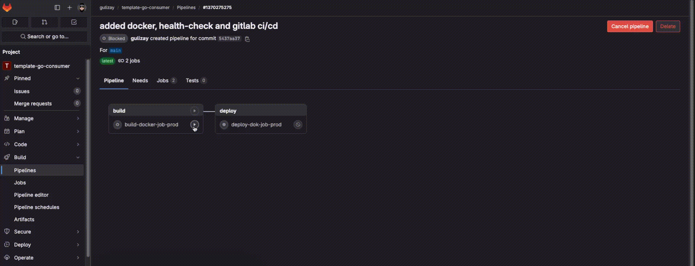
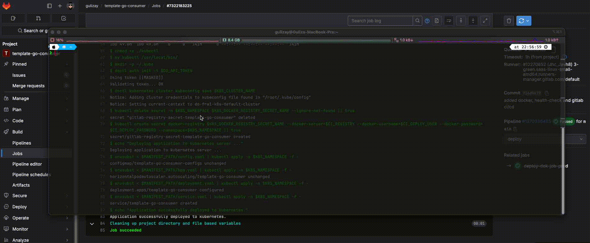

# template-go-consumer

## Create Go Project
```sh
# /app>
go mod init github.com/<username>/<project-name>
```

## Folder Structure

```
├── README.md
├── app
│   ├── cmd
│   │   ├── main.go                         // entry point
│   │   └── services
│   │       ├── services.go                 // run all services
│   │       ├── config.service.go           // init config
│   │       └── goroutine.service.go        // init goroutines
│   ├── config
│   │   └── config.go                       // all config models
│   ├── Dockerfile                          // dockerfile
│   ├── env.example.yaml                    // environment variables
│   ├── go.mod
│   ├── go.sum
│   ├── internal
│   │   ├── handlers                        // all handlers
│   │   ├── models                          // all dtos
│   │   ├── repository                      // all repositories
│   │   │   └── entities                    // all db entities
│   │   └── service                         // all services
│   ├── pkg                                 // public, reusable packages
├── .gitlab-ci.yml                          // devops ci/cd
├── k8s-manifests
│   ├── .env                                // define base environment variables
│   ├── deployment.yaml                     // kubernetes deployment
│   ├── config.yaml                         // kubernetes service configMap
│   ├── hpa.yaml                            // kubernetes service horizontal pod autoscaler
│   └── service.yaml                        // kubernetes service on cluster
```

## Docker
### build docker image
```sh
# /template-go-consumer>
docker build -t template-go-consumer ./app
docker run -p 7011:7011 -e SERVICE__ENVIRONMENT=dev -e SERVICE__PORT=7011 --name template-go-consumer template-go-consumer
```
or you can use phony target
### makefile
```sh
# /template-go-consumer>
make run_docker
make stop_docker
make docker_latest_image
```

## K8S - Deployment : DigitalOcean Kubernetes Cluster

Make sure Add DO_API_TOKEN variable to GitLab CI/CD Settings Variables, and CI_DEPLOY_USER and CI_DEPLOY_PASSWORD for the docker registry in access token


Run GitLab Pipeline, Deploy to DigitalOcean Kubernetes cluster


Check Kubernetes Deployment
